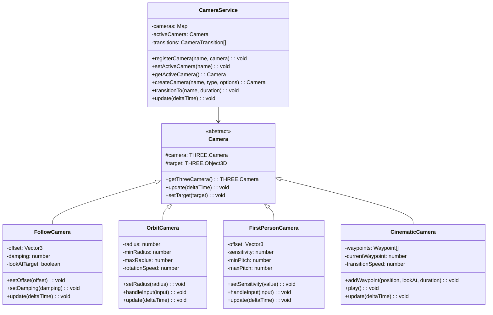
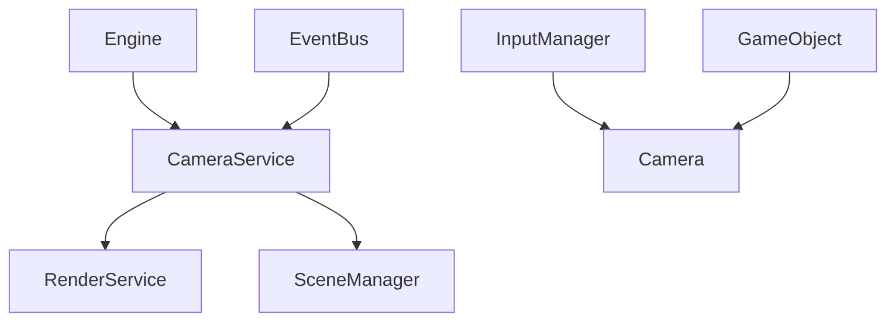

# Camera System

## Overview

The camera system provides a flexible framework for managing different camera types and behaviors within our ThreeJS game engine. This system integrates with the existing architecture to deliver dynamic viewpoints for game scenes.

## Core Architecture



## Integration with Engine

The camera system is designed to integrate seamlessly with our existing architecture:



## Camera Types

### FollowCamera

A camera that follows a target object with configurable offset and smoothing.

```typescript
class FollowCamera extends Camera {
  private offset: Vector3 = new Vector3(0, 5, 10);
  private damping: number = 5.0;
  private lookAtTarget: boolean = true;

  constructor(options?: FollowCameraOptions) {
    super();
    // Initialize with options
  }

  update(deltaTime: number): void {
    if (this.target) {
      // Calculate smooth follow position
      // Apply damping
      // Handle look-at behavior
    }
  }
}
```

### OrbitCamera

A camera that orbits around a target with configurable distance and angles.

```typescript
class OrbitCamera extends Camera {
  private radius: number = 10;
  private minRadius: number = 2;
  private maxRadius: number = 20;
  private theta: number = 0;
  private phi: number = Math.PI / 4;
  private rotationSpeed: number = 1.0;

  update(deltaTime: number): void {
    // Calculate position based on spherical coordinates
  }

  handleInput(inputManager: InputManager): void {
    // Update theta and phi based on mouse movement
    // Update radius based on scroll wheel
  }
}
```

### FirstPersonCamera

A camera that simulates a first-person perspective, typically attached to a character.

```typescript
class FirstPersonCamera extends Camera {
  private offset: Vector3 = new Vector3(0, 1.7, 0);
  private yaw: number = 0;
  private pitch: number = 0;
  private sensitivity: number = 0.2;

  update(deltaTime: number): void {
    // Position camera at target + offset
    // Apply rotation based on yaw and pitch
  }

  handleInput(inputManager: InputManager): void {
    // Update yaw and pitch based on mouse movement
    // Clamp pitch to prevent over-rotation
  }
}
```

### CinematicCamera

A camera designed for scripted sequences with predefined movements.

```typescript
interface CameraWaypoint {
  position: Vector3;
  lookAt: Vector3;
  duration: number;
  easing: EasingFunction;
}

class CinematicCamera extends Camera {
  private waypoints: CameraWaypoint[] = [];
  private currentWaypoint: number = 0;
  private elapsed: number = 0;

  addWaypoint(waypoint: CameraWaypoint): void {
    this.waypoints.push(waypoint);
  }

  play(): void {
    this.currentWaypoint = 0;
    this.elapsed = 0;
  }

  update(deltaTime: number): void {
    // Move through waypoints based on elapsed time
    // Apply easing functions for smooth movement
  }
}
```

## Camera Effects

The system supports various camera effects that can be applied to enhance visual feedback:

```typescript
interface CameraEffect {
  apply(camera: THREE.Camera, deltaTime: number): void;
  isFinished(): boolean;
}

class ShakeEffect implements CameraEffect {
  private intensity: number;
  private duration: number;
  private elapsed: number = 0;
  private originalPosition: Vector3 = new Vector3();

  apply(camera: THREE.Camera, deltaTime: number): void {
    // Apply random offset based on intensity
    // Decrease intensity over time
  }

  isFinished(): boolean {
    return this.elapsed >= this.duration;
  }
}

class ZoomEffect implements CameraEffect {
  private targetFOV: number;
  private originalFOV: number;
  private duration: number;
  private elapsed: number = 0;

  apply(camera: THREE.Camera, deltaTime: number): void {
    // Gradually change FOV from original to target
  }

  isFinished(): boolean {
    return this.elapsed >= this.duration;
  }
}
```

## Camera Transitions

The system supports smooth transitions between different cameras:

```typescript
class CameraTransition {
  private sourceCamera: Camera;
  private targetCamera: Camera;
  private duration: number;
  private elapsed: number = 0;
  private easing: EasingFunction;

  update(deltaTime: number): boolean {
    // Interpolate between source and target cameras
    // Return true when complete
  }
}
```

## Usage Examples

### Basic Setup

```typescript
// Initialize camera service with DI
@injectable()
class GameScene extends Scene {
  @inject(CameraService) private cameraService: CameraService;
  @inject(InputManager) private inputManager: InputManager;

  onEnter(): void {
    // Create player
    const player = this.createGameObject('player');

    // Create main camera
    const followCam = new FollowCamera({
      offset: new Vector3(0, 5, -10),
      damping: 3.0,
    });
    followCam.setTarget(player.getObject3D());

    // Register with service
    this.cameraService.registerCamera('main', followCam);
    this.cameraService.setActiveCamera('main');

    // Create alternate camera
    const orbitCam = new OrbitCamera({
      radius: 15,
      minRadius: 5,
      maxRadius: 30,
    });
    orbitCam.setTarget(player.getObject3D());

    this.cameraService.registerCamera('orbit', orbitCam);
  }

  update(deltaTime: number): void {
    super.update(deltaTime);

    // Handle camera switching
    if (this.inputManager.isKeyPressed('C')) {
      const current = this.cameraService.getActiveCamera();
      const next = current.getName() === 'main' ? 'orbit' : 'main';
      this.cameraService.transitionTo(next, 1.0);
    }
  }
}
```

### Cinematic Sequence

```typescript
createCutscene(): void {
  const cinematicCam = new CinematicCamera();

  // Add waypoints for camera movement
  cinematicCam.addWaypoint({
    position: new Vector3(0, 10, 20),
    lookAt: new Vector3(0, 0, 0),
    duration: 3.0,
    easing: Easing.easeInOutCubic
  });

  cinematicCam.addWaypoint({
    position: new Vector3(15, 5, 10),
    lookAt: new Vector3(0, 0, 0),
    duration: 2.5,
    easing: Easing.easeInOutQuad
  });

  // Register and play
  this.cameraService.registerCamera("cinematic", cinematicCam);
  this.cameraService.setActiveCamera("cinematic");
  cinematicCam.play();

  // Listen for completion
  this.eventBus.once("camera.sequence.complete", () => {
    this.cameraService.setActiveCamera("main");
  });
}
```

## Integration with Rendering Pipeline

The camera system integrates with the rendering pipeline to support effects like:

- Depth of Field
- Motion Blur
- Chromatic Aberration
- Post-processing effects

```typescript
class CameraPostProcessing {
  private composer: EffectComposer;
  private effects: Effect[] = [];

  addEffect(effect: Effect): void {
    this.effects.push(effect);
    this.rebuildPipeline();
  }

  removeEffect(effectType: string): void {
    // Remove effect from pipeline
  }

  rebuildPipeline(): void {
    // Setup effect composer with all current effects
  }
}
```

## Future Extensions

1. **Collision Prevention** - Stop cameras from clipping through environment geometry
2. **Camera Rails** - Define paths that cameras can move along
3. **Multi-Camera Rendering** - Support for picture-in-picture or split-screen
4. **Level-of-Detail Integration** - Change LOD based on camera distance
5. **VR/AR Support** - Extend camera system for immersive technologies

## Implementation Timeline

1. **Phase 1** - Basic camera service and core camera types
2. **Phase 2** - Camera transitions and input handling
3. **Phase 3** - Effects system and cinematic camera
4. **Phase 4** - Post-processing integration
5. **Phase 5** - Advanced features (collision, multi-camera)
