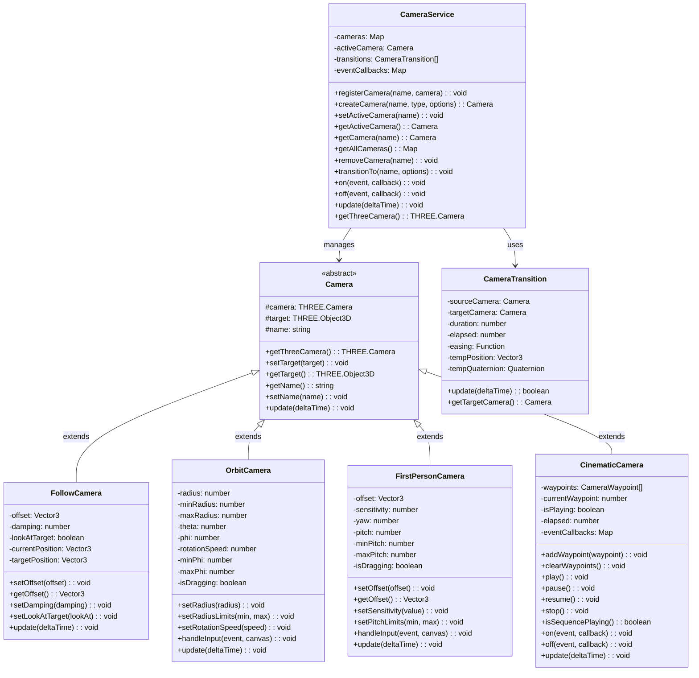
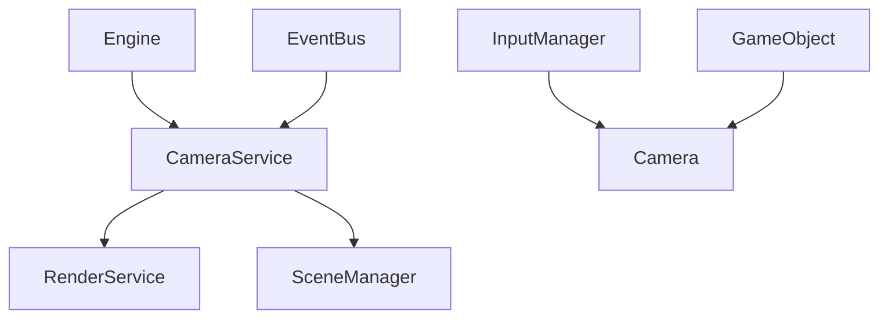

# Camera System

## Overview

The camera system provides a flexible framework for managing different camera types and behaviors within our ThreeJS game engine. The system allows for easy switching between camera modes, transitions, and specialized camera behaviors for different gameplay scenarios.

## Core Architecture

## Integration with Engine

The camera system is designed to integrate seamlessly with our existing architecture:

## Camera Types

### Camera (Base Class)

The Camera abstract base class serves as the foundation for all camera types in the system. It provides common functionality such as:

- Access to the underlying THREE.js camera
- Target object management (what the camera follows or looks at)
- Naming for camera identification
- Abstract update method that each camera type must implement

Each specialized camera extends this base class to provide custom behaviors while maintaining a consistent interface.

### FollowCamera

The FollowCamera tracks a target object with configurable behavior:

- **Offset**: Maintains a relative position to the target (e.g., behind and above)
- **Damping**: Controls how smoothly the camera follows the target (higher values create smoother movement)
- **Look-at behavior**: Can be configured to either face the target or maintain its own orientation
- **Smooth following**: Implements interpolation between current and target positions for fluid movement

This camera is ideal for third-person gameplay, vehicle following, or any scenario where the camera needs to track an object with a fixed offset.

### OrbitCamera

The OrbitCamera circles around a target object like a satellite:

- **Radius control**: Adjustable distance from the target with minimum and maximum limits
- **Spherical coordinates**: Uses theta (horizontal) and phi (vertical) angles to position the camera
- **Mouse interaction**: Supports dragging to rotate around the target and scrolling to zoom in/out
- **Constraint angles**: Prevents the camera from moving to invalid positions (like below the ground)

This camera is perfect for object inspection, strategy games, or any scenario requiring a view that can be freely rotated around a focal point.

### FirstPersonCamera

The FirstPersonCamera simulates viewing the world through a character's eyes:

- **Head offset**: Positions the camera at an appropriate height relative to the target (typically eye level)
- **Look direction**: Controlled by yaw (horizontal) and pitch (vertical) angles
- **Mouse sensitivity**: Adjustable response to mouse movement
- **Pitch limits**: Prevents looking too far up or down (avoiding unnatural angles)

This camera is essential for first-person games, immersive simulations, and virtual walkthroughs.

### CinematicCamera

The CinematicCamera enables scripted camera movements through predefined paths:

- **Waypoint system**: Defines a series of positions and orientations with specific durations
- **Easing functions**: Controls acceleration and deceleration between waypoints for natural motion
- **Playback controls**: Supports play, pause, resume, and stop functionality
- **Event system**: Emits events at key moments (sequence start/end, waypoint transitions)

This camera is ideal for cutscenes, introductions, guided tours, and any pre-planned camera choreography.

## Camera Transitions

The camera system features smooth transitions between different camera types:

- **Interpolation**: Gradually moves from source to target camera position and orientation
- **Configurable duration**: Controls how quickly transitions occur
- **Easing functions**: Allows for natural acceleration/deceleration during transitions
- **Event-based**: Triggers events at the start and completion of transitions

Transitions create cinematic continuity when switching between different camera modes, avoiding jarring cuts.

## Camera Service

The CameraService serves as the central management system for all cameras:

- **Camera registry**: Maintains a collection of all available cameras by name
- **Active camera tracking**: Manages which camera is currently being used for rendering
- **Camera creation**: Factory methods for easily instantiating different camera types
- **Transition handling**: Manages smooth transitions between cameras
- **Event system**: Allows for callbacks on camera changes and transitions
- **Update propagation**: Ensures all cameras and transitions receive update calls

The service provides a single point of control for all camera-related functionality and integrates with the broader engine architecture.

## Easing Functions

The system provides multiple easing functions to create natural motion:

- **Linear**: Constant rate of change (no easing)
- **Quadratic**: Accelerating or decelerating motion with squared rate changes
- **Cubic**: More pronounced acceleration or deceleration with cubed rate changes
- **In/Out variations**: Control whether easing occurs at the beginning, end, or both

These functions can be applied to both camera transitions and cinematic camera waypoint movements.

## Usage Scenarios

### Basic Camera Setup

A typical game scene would initialize several camera types and configure them for different situations:

1. Create a follow camera for standard third-person gameplay
2. Set up an orbit camera for inspection modes or strategic views
3. Configure the initial active camera
4. Implement input handling to switch between cameras when needed

The system makes it easy to maintain multiple camera perspectives and switch between them as gameplay requires.

### Cinematic Sequences

Creating cutscenes or guided sequences is straightforward:

1. Create a cinematic camera instance
2. Define waypoints with positions, look-at points, durations, and easing
3. Activate the camera and start playback
4. Listen for sequence completion to transition back to gameplay

This approach allows for complex camera choreography without writing custom animation code.

## Future Improvements

1. **Camera Collision Prevention** - Prevent clipping through level geometry
2. **Path-Constrained Cameras** - Allow cameras to move along predetermined paths
3. **Target Groups** - Allow cameras to target multiple objects and intelligently frame them
4. **Post-Processing Integration** - Support for depth of field, motion blur, and other effects
5. **Camera Shake and Effects** - Built-in support for impact feedback and visual effects
6. **VR/AR Camera Support** - Extend the system for immersive technologies

## Implementation Timeline

1. **Phase 1** - Basic camera service and core camera types
2. **Phase 2** - Camera transitions and input handling
3. **Phase 3** - Effects system and cinematic camera
4. **Phase 4** - Post-processing integration
5. **Phase 5** - Advanced features (collision, multi-camera)
