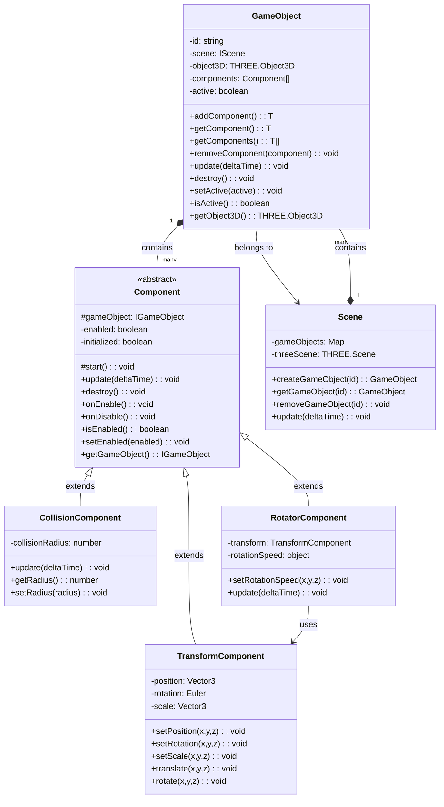
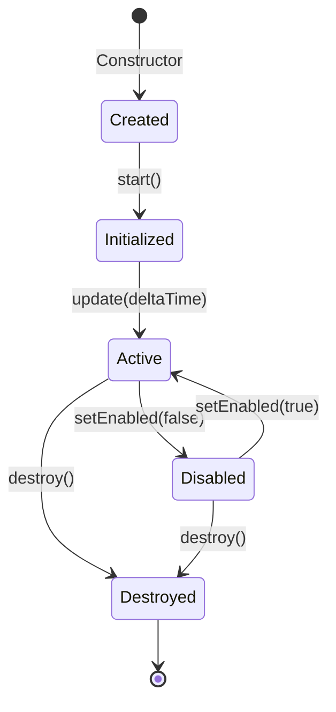
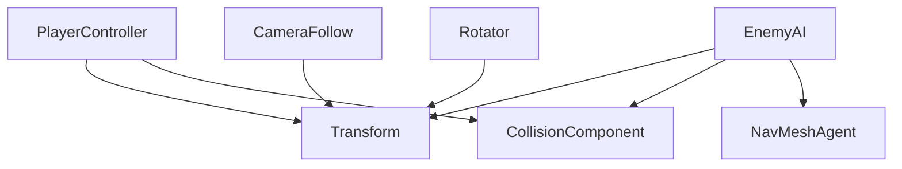

# Component System

This document outlines the component-based architecture that forms the foundation of our game engine, inspired by established engines like Unity and Unreal.

## Design Principles

- **Composition over Inheritance**: Objects are built by combining components rather than deep inheritance hierarchies
- **Separation of Concerns**: Each component handles a specific aspect of functionality
- **Reusability**: Components can be reused across different game objects
- **Flexibility**: Game objects can be constructed from various component combinations
- **Modularity**: Components can be added or removed at runtime

## System Architecture



## Core Classes

### Component Base Class

All components in the engine extend the abstract `Component` class, which provides the foundation for the component system.

```typescript
abstract class Component {
  // Reference to the parent GameObject
  protected gameObject: IGameObject;
  // Whether the component is enabled
  private enabled: boolean = true;
  // Whether the component has been initialized
  private initialized: boolean = false;

  constructor(gameObject: IGameObject) {
    this.gameObject = gameObject;
  }

  // Protected method called during initialization
  protected start(): void {}

  // Called once per frame, if the component is enabled
  update(deltaTime: number): void {}

  // Called when the component or its game object is destroyed
  destroy(): void {}

  // Called when the component is enabled
  onEnable(): void {}

  // Called when the component is disabled
  onDisable(): void {}

  // Checks if the component is enabled
  isEnabled(): boolean {
    return this.enabled;
  }

  // Enables or disables the component
  setEnabled(enabled: boolean): void {
    /* ... */
  }

  // Gets the parent GameObject
  getGameObject(): IGameObject {
    return this.gameObject;
  }
}
```

### GameObject Class

The `GameObject` class manages collections of components and provides methods for adding, getting, and removing components.

```typescript
class GameObject implements IGameObject {
  private id: string;
  private scene: IScene;
  private object3D: THREE.Object3D;
  private components: Component[] = [];
  private active: boolean = true;

  // Adds a component of the specified type
  public addComponent<T extends Component>(
    componentType: new (gameObject: IGameObject) => T
  ): T {
    /* ... */
  }

  // Gets the first component of the specified type
  public getComponent<T extends Component>(
    componentType: new (...args: any[]) => T
  ): T | null {
    /* ... */
  }

  // Gets all components of the specified type
  public getComponents<T extends Component>(
    componentType: new (...args: any[]) => T
  ): T[] {
    /* ... */
  }

  // Removes the specified component
  public removeComponent(component: Component): void {
    /* ... */
  }

  // Updates all active components
  public update(deltaTime: number): void {
    /* ... */
  }

  // Destroys the game object and all its components
  public destroy(): void {
    /* ... */
  }
}
```

## Component Lifecycle



1. **Creation**: Component is instantiated with a reference to its GameObject
2. **Initialization**: `start()` is called once when the component is first activated
3. **Update**: `update(deltaTime)` is called every frame if the component is enabled
4. **Enable/Disable**: `onEnable()` and `onDisable()` are called when the component is enabled or disabled
5. **Destruction**: `destroy()` is called when the component or its GameObject is destroyed

## Common Components

### Transform Component

Handles position, rotation, and scale of a game object.

```typescript
class Transform extends Component {
  private position: THREE.Vector3;
  private rotation: THREE.Euler;
  private scale: THREE.Vector3;

  constructor(gameObject: IGameObject) {
    super(gameObject);
    const obj = this.gameObject.getObject3D();
    this.position = obj.position;
    this.rotation = obj.rotation;
    this.scale = obj.scale;
  }

  public setPosition(x: number, y: number, z: number): void {
    this.position.set(x, y, z);
  }

  public setRotation(x: number, y: number, z: number): void {
    this.rotation.set(x, y, z);
  }

  public setScale(x: number, y: number, z: number): void {
    this.scale.set(x, y, z);
  }

  public translate(x: number, y: number, z: number): void {
    this.position.x += x;
    this.position.y += y;
    this.position.z += z;
  }

  public rotate(x: number, y: number, z: number): void {
    this.rotation.x += x;
    this.rotation.y += y;
    this.rotation.z += z;
  }
}
```

### Rotator Component

Continuously rotates a game object, demonstrating component dependencies.

```typescript
class Rotator extends Component {
  private transform: Transform | null = null;
  private rotationSpeed: { x: number; y: number; z: number } = {
    x: 0,
    y: 0,
    z: 0,
  };

  protected start(): void {
    // Get or add the Transform component
    this.transform = this.gameObject.getComponent(Transform);
    if (!this.transform) {
      this.transform = this.gameObject.addComponent(Transform);
    }
  }

  public setRotationSpeed(x: number, y: number, z: number): void {
    this.rotationSpeed.x = x;
    this.rotationSpeed.y = y;
    this.rotationSpeed.z = z;
  }

  update(deltaTime: number): void {
    if (!this.transform || !this.isEnabled()) return;

    this.transform.rotate(
      this.rotationSpeed.x * deltaTime,
      this.rotationSpeed.y * deltaTime,
      this.rotationSpeed.z * deltaTime
    );
  }
}
```

### Collision Component

Detects collisions between game objects, demonstrating event-based communication.

```typescript
class CollisionComponent extends Component {
  private eventBus: EventBus;
  private collisionRadius: number;
  private lastCollisionTime: number = 0;
  private collisionCooldown: number = 0.5; // seconds

  constructor(gameObject: IGameObject, radius: number = 1) {
    super(gameObject);
    this.eventBus = container.resolve(EventBus);
    this.collisionRadius = radius;
  }

  update(deltaTime: number): void {
    if (!this.isEnabled()) return;

    // Check for collisions with other game objects
    const myPosition = this.gameObject.getObject3D().position;
    const gameObjects = this.gameObject.getScene().getAllGameObjects();

    for (const otherObject of gameObjects) {
      // Skip self and objects without collision
      if (otherObject.getId() === this.gameObject.getId()) continue;
      const otherCollision = otherObject.getComponent(CollisionComponent);
      if (!otherCollision || !otherCollision.isEnabled()) continue;

      const otherPosition = otherObject.getObject3D().position;
      const distance = myPosition.distanceTo(otherPosition);

      // Check if objects are colliding
      if (distance < this.collisionRadius + otherCollision.getRadius()) {
        this.eventBus.emit('collision', this.gameObject, otherObject);
      }
    }
  }
}
```

## Component Communication Patterns

Components can communicate with each other using several patterns:

### 1. Direct References

Components can get direct references to other components on the same GameObject:

```typescript
// Get a reference to another component
const transform = this.gameObject.getComponent(Transform);
if (transform) {
  transform.setPosition(0, 1, 0);
}
```

### 2. Event System

Components can communicate through a central event bus:

```typescript
// Emit an event
this.eventBus.emit('collision', this.gameObject, otherObject);

// Listen for an event
this.eventBus.on('collision', (gameObject1, gameObject2) => {
  // Handle collision
});
```

### 3. Service Injection

Components can access shared services via dependency injection:

```typescript
// Inject a service
constructor(gameObject: IGameObject) {
  super(gameObject);
  this.inputManager = container.resolve(InputManager);
}

// Use the service
if (this.inputManager.isKeyPressed('Space')) {
  // Handle key press
}
```

## Component Dependencies

Components can depend on other components, which can be resolved at runtime:



## Component Creation Patterns

### Simple Creation

```typescript
// Create a game object and add components
const player = scene.createGameObject('player');
player.addComponent(Transform).setPosition(0, 0, 0);
player.addComponent(PlayerController);
```

### Component Dependencies

```typescript
// Component that requires another component
class Rotator extends Component {
  protected start(): void {
    // Get or add dependency
    this.transform = this.gameObject.getComponent(Transform);
    if (!this.transform) {
      this.transform = this.gameObject.addComponent(Transform);
    }
  }
}
```

### Component Configuration

```typescript
// Add and configure a component in a fluent style
const collider = gameObject
  .addComponent(CollisionComponent)
  .setRadius(1.5)
  .setEnabled(true);
```

## Component Composition Examples

### Player Character

```typescript
// Create a player character with multiple components
const player = scene.createGameObject('player');

// Add basic transform
player.addComponent(Transform).setPosition(0, 1, 0);

// Add visual representation
player.addComponent(ModelComponent).setModel('playerModel');

// Add physics
player.addComponent(RigidBodyComponent).setMass(70);
player.addComponent(CapsuleCollider).setRadius(0.5).setHeight(1.8);

// Add character controller
player.addComponent(CharacterController).setMoveSpeed(5).setJumpForce(8);

// Add health system
player.addComponent(HealthComponent).setMaxHealth(100);

// Add input handling
player.addComponent(PlayerInputHandler);

// Add animation
player.addComponent(AnimationComponent).setAnimationController('humanoid');
```

### Interactive Object

```typescript
// Create an interactive object
const chest = scene.createGameObject('treasure_chest');

// Add basic components
chest.addComponent(Transform).setPosition(10, 0, 5);
chest.addComponent(ModelComponent).setModel('chestModel');

// Add interaction components
chest.addComponent(InteractableComponent).setInteractionDistance(2);
chest.addComponent(CollisionComponent).setRadius(1);

// Add custom behavior
const chestController = chest.addComponent(ChestController);
chestController.setContents([
  { itemId: 'gold_coin', amount: 50 },
  { itemId: 'health_potion', amount: 2 },
]);
```

## Best Practices

1. **Single Responsibility**: Each component should handle one aspect of functionality
2. **Minimal Dependencies**: Minimize dependencies between components
3. **Late Initialization**: Initialize references in `start()` rather than in the constructor
4. **Null Checking**: Always check for null component references
5. **Clean Destruction**: Release all resources in `destroy()`
6. **State Management**: Keep component state consistent
7. **Performance**: Optimize components for performance critical operations
8. **Event Cleanup**: Remove event listeners in `destroy()`

## Implementation Guidelines

1. **Component Registration**: Components don't need explicit registration
2. **Component Instantiation**: Components are instantiated through the `addComponent` method
3. **Component Retrieval**: Use `getComponent` and `getComponents` to retrieve components
4. **Component Removal**: Use `removeComponent` to remove components
5. **Component Activation**: Use `setEnabled` to activate or deactivate components

## Advanced Considerations

### Component Serialization

Future work will include serializing components to JSON and back:

```typescript
interface ISerializable {
  serialize(): any;
  deserialize(data: any): void;
}

// Component that supports serialization
class SerializableComponent extends Component implements ISerializable {
  serialize(): any {
    return {
      // Serialize component state
    };
  }

  deserialize(data: any): void {
    // Restore component state from serialized data
  }
}
```

### Component Templates (Prefabs)

Future work will include component templates (prefabs) for reusable game objects:

```typescript
class Prefab {
  static createPlayer(scene: IScene, position: THREE.Vector3): IGameObject {
    const player = scene.createGameObject('player');
    player
      .addComponent(Transform)
      .setPosition(position.x, position.y, position.z);
    // Add other components
    return player;
  }
}

// Usage
const player = Prefab.createPlayer(scene, new THREE.Vector3(0, 0, 0));
```

## Conclusion

The component system provides a flexible and powerful foundation for building game objects with diverse behaviors. By following component-based design principles, we can create reusable, modular, and maintainable code while allowing for complex interactions between different parts of the game.

This architecture supports many types of games and interactive experiences while providing a familiar development model for those with experience in other popular game engines.
