# ThreeJS Basic Game Engine Architecture

## Current Architecture Overview

The current architecture implements a foundational 3D game engine using Three.js with a clean, component-based design. The system follows these key architectural patterns:

- **Dependency Injection** via TSyringe for service management
- **Component Pattern** similar to Unity for game object composition
- **Scene-based** organization for game state management
- **Service-oriented** design for cross-cutting concerns

### Core Architecture Diagram

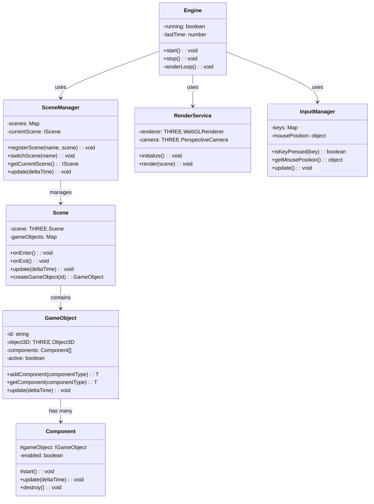

### Game Loop Sequence

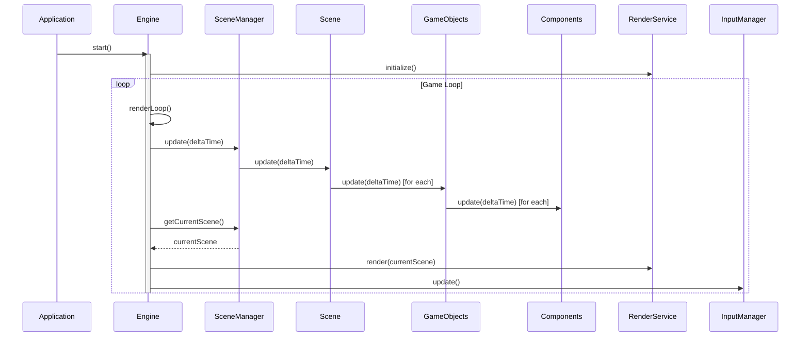

### Core Components

1. **Engine**: Central game loop managing updates and rendering
2. **Scene**: Contains and manages GameObjects
3. **GameObject**: Container for Components, similar to Unity's concept
4. **Component**: Base class for all game behaviors
5. **RenderService**: Handles Three.js rendering
6. **InputManager**: Manages keyboard and mouse input

### Strengths

- Clean separation of concerns with DI
- Unity-like component architecture provides familiarity
- Scene management system for organized state transitions
- Strong TypeScript typing throughout the codebase
- Decoupled subsystems via interfaces and dependency injection

## Architecture Improvement Proposal

While the current architecture provides a solid foundation, the following enhancements would strengthen the engine's capabilities:

### Proposed Enhanced Architecture

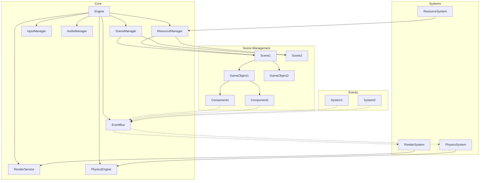

### 1. Entity Component System (ECS) Optimization

Consider evolving the current component system toward a more data-oriented ECS design:

```typescript
// Example: Systems operating on component data
class PhysicsSystem {
  update(deltaTime: number, entities: Entity[]): void {
    entities
      .filter((e) => e.hasComponent(RigidBody) && e.hasComponent(Transform))
      .forEach((entity) => {
        const body = entity.getComponent<RigidBody>(RigidBody);
        const transform = entity.getComponent<Transform>(Transform);
        // Apply physics
      });
  }
}
```

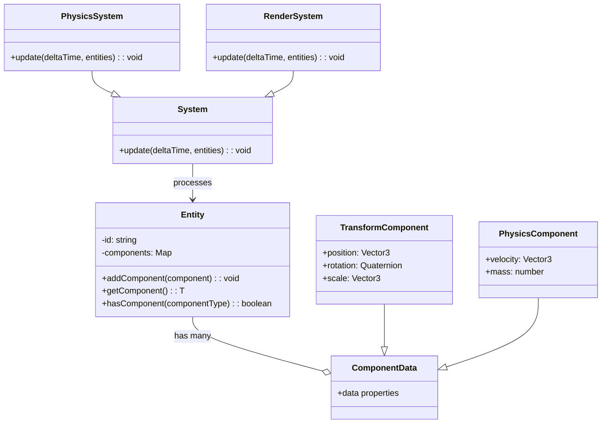

Benefits:

- Better performance for games with many entities
- More cache-friendly data organization
- Clearer separation between data and behavior

### 2. Resource Management System

Add a dedicated resource management system:

```typescript
@injectable()
@singleton()
class ResourceManager {
  private textures: Map<string, THREE.Texture> = new Map();
  private models: Map<string, THREE.Mesh> = new Map();

  async loadTexture(key: string, url: string): Promise<THREE.Texture> {
    // Load and cache texture
  }

  async loadModel(key: string, url: string): Promise<THREE.Mesh> {
    // Load and cache model
  }
}
```

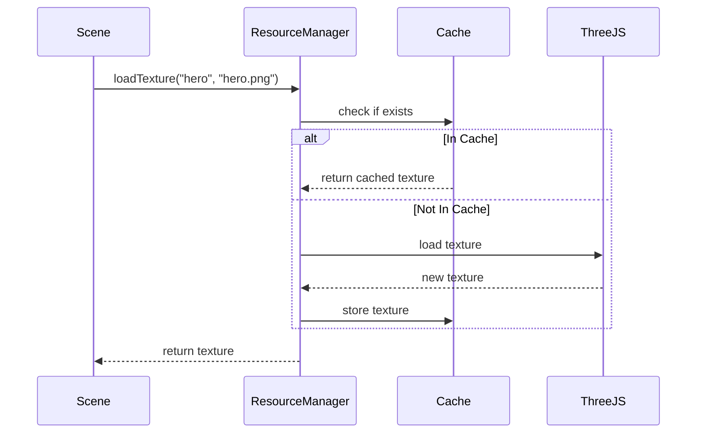

Benefits:

- Centralized asset loading and caching
- Memory usage optimization
- Asset reference counting and garbage collection

### 3. Event System

Implement a robust event system:

```typescript
@injectable()
@singleton()
class EventBus {
  private listeners: Map<string, Function[]> = new Map();

  on(event: string, callback: Function): void {
    // Add listener
  }

  off(event: string, callback: Function): void {
    // Remove listener
  }

  emit(event: string, ...args: any[]): void {
    // Trigger event
  }
}
```

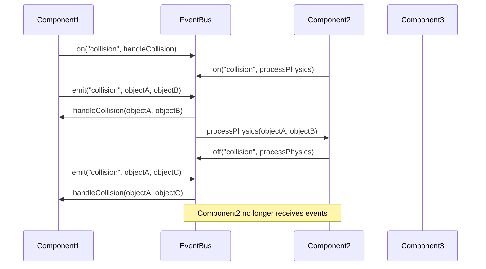

Benefits:

- Decoupled communication between systems
- Easier implementation of observer patterns
- Simplified cross-component coordination

### 4. Physics Integration

Add a physics abstraction layer:

```typescript
interface IPhysicsEngine {
  createRigidBody(mass: number): any;
  simulate(deltaTime: number): void;
  // etc.
}

@injectable()
class AmmoPhysics implements IPhysicsEngine {
  // Implementation using Ammo.js
}
```

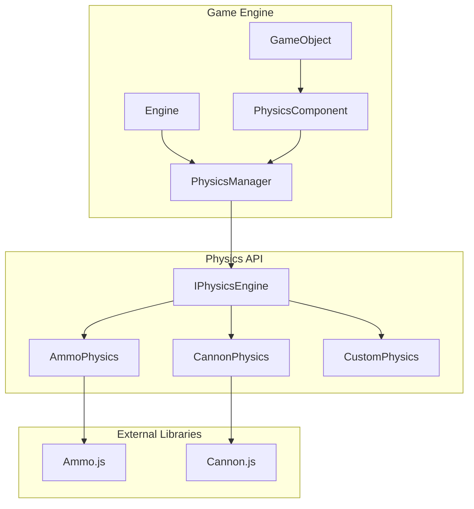

Benefits:

- Physics simulation capabilities
- Collision detection and response
- Potential for swappable physics backends

### 5. Enhanced Scene Management

Extend the scene management with loading and transitions:

```typescript
@injectable()
@singleton()
class SceneManager {
  // Existing implementation

  async loadSceneAsync(name: string): Promise<void> {
    // Show loading screen
    // Load scene assets
    // Initialize scene
    // Hide loading screen
  }

  transitionTo(name: string, transitionEffect: TransitionEffect): void {
    // Apply transition effect while switching scenes
  }
}
```

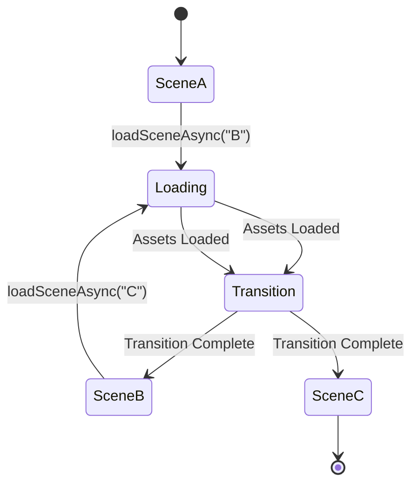

Benefits:

- Smoother scene transitions with effects
- Asynchronous scene loading with progress tracking
- Better user experience during level changes

### 6. Serialization System

Add serialization capabilities:

```typescript
interface ISerializable {
  serialize(): any;
  deserialize(data: any): void;
}

// Implementation in GameObject and Components
```

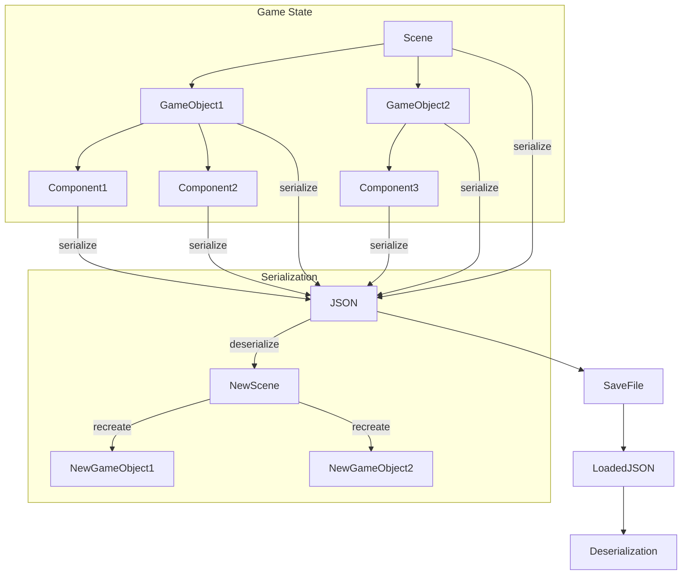

Benefits:

- Save/load game state
- Level editing capabilities
- Network synchronization foundation

### 7. Audio Management

Implement a dedicated audio system:

```typescript
@injectable()
@singleton()
class AudioManager {
  playSound(id: string, options?: AudioOptions): void {}
  playMusic(id: string, options?: AudioOptions): void {}
  stopAll(): void {}
  // etc.
}
```

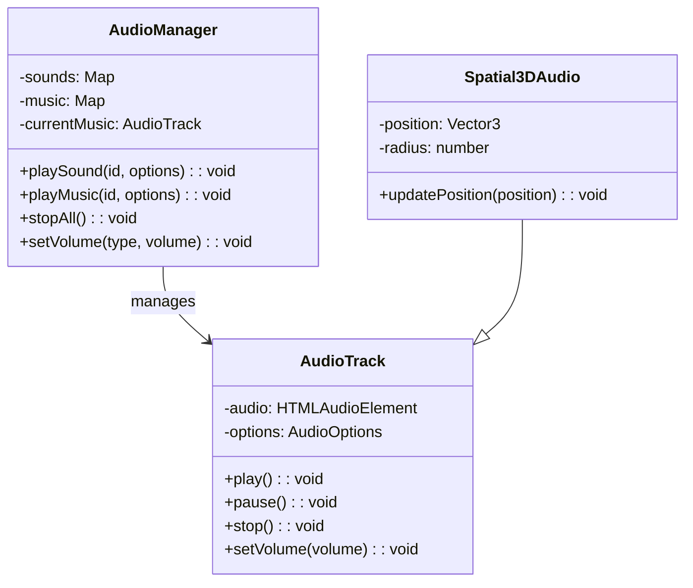

Benefits:

- Organized sound effect and music playback
- Spatial audio for 3D environments
- Audio pooling for performance

### 8. Rendering Pipeline Enhancements

Extend the render service with post-processing and lighting:

```typescript
@injectable()
@singleton()
class RenderService {
  // Existing implementation

  enablePostProcessing(effects: PostProcessEffect[]): void {}
  setLightingModel(model: LightingModel): void {}
  // etc.
}
```

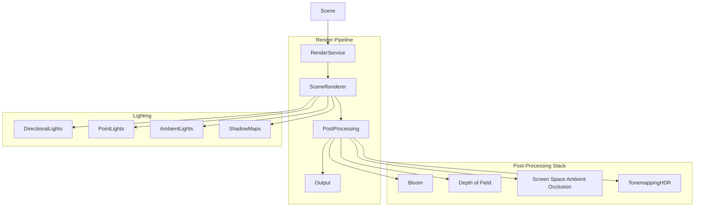

Benefits:

- Visual effects like bloom, DOF, etc.
- Advanced lighting models
- Render-to-texture capabilities

## Implementation Roadmap

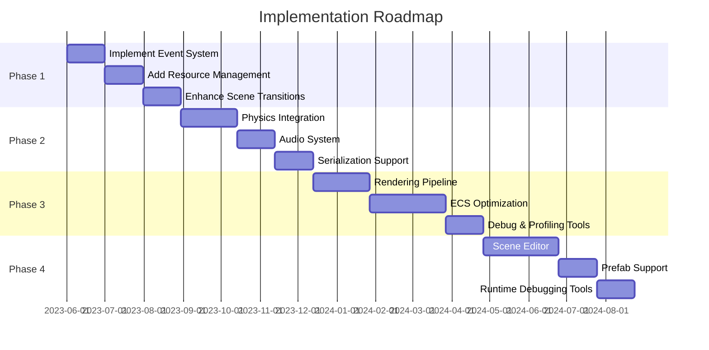

1. **Phase 1**: Refine core architecture

   - Implement event system
   - Add resource management
   - Enhance scene transitions

2. **Phase 2**: Expand game capabilities

   - Add physics integration
   - Implement audio system
   - Add serialization support

3. **Phase 3**: Graphics and performance

   - Enhance rendering pipeline
   - Optimize for performance with ECS principles
   - Add debug and profiling tools

4. **Phase 4**: Tools and workflow
   - Create a simple scene editor
   - Add prefab support for reusable game objects
   - Implement runtime debugging tools

## Conclusion

The current architecture provides a solid foundation with clear separation of concerns and a familiar component pattern. By implementing the proposed enhancements incrementally, the engine can evolve into a more capable platform while maintaining its clean design.

The priority should be on building features that directly enable game development workflows rather than attempting to compete with fully-featured commercial engines. Focus on creating a lightweight, performant engine that excels at specific use cases rather than trying to be all things to all developers.

## Modular Architecture Update (2023)

To improve maintainability and organization, the engine has been restructured into a modular architecture:

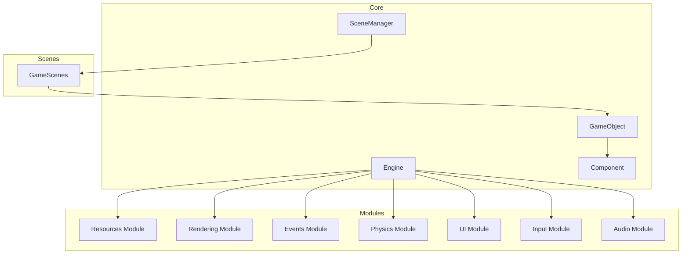

### Implemented Modules

The following modules have been implemented:

1. **Resources Module**: Asset loading and management

   - ResourceManager - Central service for loading and managing game assets
   - ResourceCache - System for caching loaded assets
   - Loaders - Specialized loaders for different asset types (TextureLoader, ModelLoader, etc.)

2. **Rendering Module**: Graphics rendering

   - RenderService - Handles Three.js rendering and camera management

3. **Events Module**: Event communication

   - EventBus - Pub/sub system for decoupled communication

4. **Physics Module**: Physics simulation

   - CollisionComponent - Detects collisions between game objects
   - CollisionHandlerComponent - Handles collision responses

5. **UI Module**: User interface management
   - UIService - Manages UI components and rendering

### Remaining Work

1. **Input Module**: Currently exists as InputManager in utils but should be migrated
2. **Audio Module**: To be implemented for sound and music playback

### Path Alias System

The engine now uses a path alias system for cleaner imports:

```typescript
// Before
import { ResourceManager } from '../../services/ResourceManager';

// After
import { ResourceManager } from '@modules/resources/ResourceManager';
```

See the [Folder Restructuring](folder-restructuring.md) document for more details about the new architecture.
