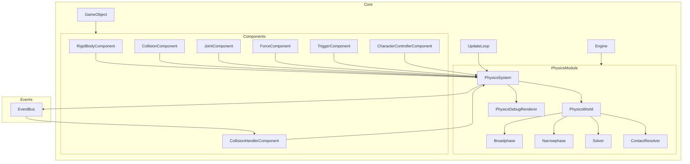

# Physics System

This document outlines the complete physics system for our game engine, building on the existing work in the Physics Module and taking inspiration from established engines like Unity, Unreal, and Godot.

## Design Principles

- **Modular Architecture**: The physics system is a self-contained module that integrates with the core engine
- **Component-Based**: Physics functionality is exposed through components that can be attached to game objects
- **Abstraction Layer**: Provides a clean API that could support multiple physics backends
- **Performance-Focused**: Optimized for efficient simulation of many objects
- **Extensible**: Easily extended with new physics features and behaviors

## System Architecture



## Core Components

### PhysicsSystem

The central coordinator for all physics processing.

```typescript
@injectable()
@singleton()
class PhysicsSystem {
  private world: PhysicsWorld;
  private bodies: Map<string, RigidBody> = new Map();
  private fixedTimeStep: number = 1 / 60;
  private maxSubSteps: number = 3;

  constructor(@inject(EventBus) private eventBus: EventBus) {
    this.world = new PhysicsWorld();
  }

  initialize(): void {
    // Initialize physics world
  }

  update(deltaTime: number): void {
    // Step physics simulation with fixed timestep
    this.world.step(this.fixedTimeStep, deltaTime, this.maxSubSteps);

    // Update transforms of associated game objects
    this.updateTransforms();

    // Dispatch collision events
    this.dispatchCollisionEvents();
  }

  registerBody(gameObjectId: string, body: RigidBody): void {
    this.bodies.set(gameObjectId, body);
    this.world.addBody(body);
  }

  removeBody(gameObjectId: string): void {
    const body = this.bodies.get(gameObjectId);
    if (body) {
      this.world.removeBody(body);
      this.bodies.delete(gameObjectId);
    }
  }

  // Additional methods for raycasting, queries, etc.
  castRay(from: Vector3, to: Vector3): RaycastResult {
    /* ... */
  }
  queryOverlap(shape: CollisionShape, position: Vector3): GameObject[] {
    /* ... */
  }

  private updateTransforms(): void {
    /* ... */
  }
  private dispatchCollisionEvents(): void {
    /* ... */
  }
}
```

### PhysicsWorld

Encapsulates the actual physics simulation.

```typescript
class PhysicsWorld {
  private gravity: Vector3 = new Vector3(0, -9.81, 0);
  private bodies: RigidBody[] = [];
  private collisionPairs: CollisionPair[] = [];

  constructor() {
    // Initialize broadphase, narrowphase, solver, etc.
  }

  setGravity(gravity: Vector3): void {
    this.gravity = gravity;
  }

  addBody(body: RigidBody): void {
    this.bodies.push(body);
  }

  removeBody(body: RigidBody): void {
    const index = this.bodies.indexOf(body);
    if (index !== -1) {
      this.bodies.splice(index, 1);
    }
  }

  step(fixedTimeStep: number, deltaTime: number, maxSubSteps: number): void {
    // Perform collision detection
    this.detectCollisions();

    // Solve constraints
    this.solveConstraints();

    // Integrate velocities and positions
    this.integrate(fixedTimeStep);
  }

  private detectCollisions(): void {
    /* ... */
  }
  private solveConstraints(): void {
    /* ... */
  }
  private integrate(timeStep: number): void {
    /* ... */
  }
}
```

## Physics Components

### RigidBodyComponent

```typescript
class RigidBodyComponent extends Component {
  private body: RigidBody;
  private bodyType: BodyType = BodyType.Dynamic;
  private mass: number = 1;
  private linearDamping: number = 0.01;
  private angularDamping: number = 0.01;
  private restitution: number = 0.3;
  private friction: number = 0.5;

  constructor(@inject(PhysicsSystem) private physicsSystem: PhysicsSystem) {
    super();
  }

  start(): void {
    const transform =
      this.gameObject.getComponent<TransformComponent>(TransformComponent);
    if (!transform) {
      console.error('RigidBodyComponent requires a TransformComponent');
      return;
    }

    this.body = new RigidBody({
      type: this.bodyType,
      mass: this.mass,
      position: transform.position,
      rotation: transform.rotation,
    });

    this.physicsSystem.registerBody(this.gameObject.id, this.body);
  }

  update(deltaTime: number): void {
    if (this.bodyType === BodyType.Static) return;

    // Update transform component from physics body
    const transform =
      this.gameObject.getComponent<TransformComponent>(TransformComponent);
    if (transform) {
      transform.position.copy(this.body.position);
      transform.rotation.copy(this.body.rotation);
    }
  }

  destroy(): void {
    this.physicsSystem.removeBody(this.gameObject.id);
  }

  // Configuration methods
  setBodyType(type: BodyType): this {
    this.bodyType = type;
    if (this.body) {
      this.body.setType(type);
    }
    return this;
  }

  setMass(mass: number): this {
    this.mass = mass;
    if (this.body) {
      this.body.setMass(mass);
    }
    return this;
  }

  // Force application methods
  applyForce(force: Vector3, worldPoint?: Vector3): void {
    if (this.body) {
      this.body.applyForce(force, worldPoint);
    }
  }

  applyImpulse(impulse: Vector3, worldPoint?: Vector3): void {
    if (this.body) {
      this.body.applyImpulse(impulse, worldPoint);
    }
  }

  applyTorque(torque: Vector3): void {
    if (this.body) {
      this.body.applyTorque(torque);
    }
  }
}

enum BodyType {
  Static,
  Dynamic,
  Kinematic,
}
```

### CollisionComponent

```typescript
class CollisionComponent extends Component {
  private shape: CollisionShape;
  private isTrigger: boolean = false;
  private collisionLayer: number = 1;
  private collisionMask: number = 0xffff;

  constructor(@inject(PhysicsSystem) private physicsSystem: PhysicsSystem) {
    super();
  }

  start(): void {
    const rigidbody =
      this.gameObject.getComponent<RigidBodyComponent>(RigidBodyComponent);
    if (rigidbody && rigidbody.body) {
      rigidbody.body.setCollisionShape(this.shape);
      rigidbody.body.setCollisionFlags({
        isTrigger: this.isTrigger,
        collisionLayer: this.collisionLayer,
        collisionMask: this.collisionMask,
      });
    }
  }

  // Shape configuration
  setBoxShape(halfExtents: Vector3): this {
    this.shape = new BoxShape(halfExtents);
    return this;
  }

  setSphereShape(radius: number): this {
    this.shape = new SphereShape(radius);
    return this;
  }

  setCapsuleShape(radius: number, height: number): this {
    this.shape = new CapsuleShape(radius, height);
    return this;
  }

  setCustomShape(vertices: Vector3[], indices: number[]): this {
    this.shape = new ConvexShape(vertices, indices);
    return this;
  }

  // Collision filtering
  setCollisionLayer(layer: number): this {
    this.collisionLayer = layer;
    return this;
  }

  setCollisionMask(mask: number): this {
    this.collisionMask = mask;
    return this;
  }

  setAsTrigger(isTrigger: boolean): this {
    this.isTrigger = isTrigger;
    return this;
  }
}
```

### CollisionHandlerComponent

```typescript
class CollisionHandlerComponent extends Component {
  private onCollisionEnterCallbacks: ((
    other: IGameObject,
    contact: ContactPoint
  ) => void)[] = [];
  private onCollisionStayCallbacks: ((
    other: IGameObject,
    contact: ContactPoint
  ) => void)[] = [];
  private onCollisionExitCallbacks: ((other: IGameObject) => void)[] = [];
  private onTriggerEnterCallbacks: ((other: IGameObject) => void)[] = [];
  private onTriggerExitCallbacks: ((other: IGameObject) => void)[] = [];

  constructor(@inject(EventBus) private eventBus: EventBus) {
    super();
  }

  start(): void {
    this.eventBus.on(
      `collision:enter:${this.gameObject.id}`,
      this.handleCollisionEnter.bind(this)
    );
    this.eventBus.on(
      `collision:stay:${this.gameObject.id}`,
      this.handleCollisionStay.bind(this)
    );
    this.eventBus.on(
      `collision:exit:${this.gameObject.id}`,
      this.handleCollisionExit.bind(this)
    );
    this.eventBus.on(
      `trigger:enter:${this.gameObject.id}`,
      this.handleTriggerEnter.bind(this)
    );
    this.eventBus.on(
      `trigger:exit:${this.gameObject.id}`,
      this.handleTriggerExit.bind(this)
    );
  }

  destroy(): void {
    this.eventBus.off(`collision:enter:${this.gameObject.id}`);
    this.eventBus.off(`collision:stay:${this.gameObject.id}`);
    this.eventBus.off(`collision:exit:${this.gameObject.id}`);
    this.eventBus.off(`trigger:enter:${this.gameObject.id}`);
    this.eventBus.off(`trigger:exit:${this.gameObject.id}`);
  }

  // Event registration methods
  onCollisionEnter(
    callback: (other: IGameObject, contact: ContactPoint) => void
  ): this {
    this.onCollisionEnterCallbacks.push(callback);
    return this;
  }

  onCollisionStay(
    callback: (other: IGameObject, contact: ContactPoint) => void
  ): this {
    this.onCollisionStayCallbacks.push(callback);
    return this;
  }

  onCollisionExit(callback: (other: IGameObject) => void): this {
    this.onCollisionExitCallbacks.push(callback);
    return this;
  }

  onTriggerEnter(callback: (other: IGameObject) => void): this {
    this.onTriggerEnterCallbacks.push(callback);
    return this;
  }

  onTriggerExit(callback: (other: IGameObject) => void): this {
    this.onTriggerExitCallbacks.push(callback);
    return this;
  }

  private handleCollisionEnter(data: {
    other: IGameObject;
    contact: ContactPoint;
  }): void {
    this.onCollisionEnterCallbacks.forEach((callback) =>
      callback(data.other, data.contact)
    );
  }

  private handleCollisionStay(data: {
    other: IGameObject;
    contact: ContactPoint;
  }): void {
    this.onCollisionStayCallbacks.forEach((callback) =>
      callback(data.other, data.contact)
    );
  }

  private handleCollisionExit(data: { other: IGameObject }): void {
    this.onCollisionExitCallbacks.forEach((callback) => callback(data.other));
  }

  private handleTriggerEnter(data: { other: IGameObject }): void {
    this.onTriggerEnterCallbacks.forEach((callback) => callback(data.other));
  }

  private handleTriggerExit(data: { other: IGameObject }): void {
    this.onTriggerExitCallbacks.forEach((callback) => callback(data.other));
  }
}
```

### JointComponent

```typescript
class JointComponent extends Component {
  private joint: Joint;
  private jointType: JointType = JointType.Hinge;
  private connectedBody: RigidBodyComponent;

  constructor(@inject(PhysicsSystem) private physicsSystem: PhysicsSystem) {
    super();
  }

  start(): void {
    const rigidbody =
      this.gameObject.getComponent<RigidBodyComponent>(RigidBodyComponent);
    if (!rigidbody) {
      console.error('JointComponent requires a RigidBodyComponent');
      return;
    }

    if (!this.connectedBody) {
      console.error('JointComponent requires a connected body');
      return;
    }

    switch (this.jointType) {
      case JointType.Hinge:
        this.joint = new HingeJoint(rigidbody.body, this.connectedBody.body);
        break;
      case JointType.Fixed:
        this.joint = new FixedJoint(rigidbody.body, this.connectedBody.body);
        break;
      case JointType.Spring:
        this.joint = new SpringJoint(rigidbody.body, this.connectedBody.body);
        break;
      // More joint types
    }

    this.physicsSystem.addJoint(this.joint);
  }

  destroy(): void {
    if (this.joint) {
      this.physicsSystem.removeJoint(this.joint);
    }
  }

  // Configuration methods
  setConnectedBody(body: RigidBodyComponent): this {
    this.connectedBody = body;
    return this;
  }

  setJointType(type: JointType): this {
    this.jointType = type;
    return this;
  }

  // Joint specific configuration methods
  setHingeAxis(axis: Vector3): this {
    if (this.joint && this.joint instanceof HingeJoint) {
      (this.joint as HingeJoint).setAxis(axis);
    }
    return this;
  }

  setSpringValues(stiffness: number, damping: number): this {
    if (this.joint && this.joint instanceof SpringJoint) {
      (this.joint as SpringJoint).setSpringValues(stiffness, damping);
    }
    return this;
  }
}

enum JointType {
  Hinge,
  Fixed,
  Spring,
  Slider,
  Distance,
  Point,
  Configurable,
}
```

### CharacterControllerComponent

```typescript
class CharacterControllerComponent extends Component {
  private controller: CharacterController;
  private height: number = 2;
  private radius: number = 0.5;
  private stepHeight: number = 0.3;
  private slopeLimit: number = 45;

  constructor(
    @inject(PhysicsSystem) private physicsSystem: PhysicsSystem,
    @inject(InputManager) private inputManager: InputManager
  ) {
    super();
  }

  start(): void {
    const transform =
      this.gameObject.getComponent<TransformComponent>(TransformComponent);
    if (!transform) {
      console.error(
        'CharacterControllerComponent requires a TransformComponent'
      );
      return;
    }

    this.controller = new CharacterController({
      height: this.height,
      radius: this.radius,
      stepHeight: this.stepHeight,
      slopeLimit: this.slopeLimit,
      position: transform.position,
    });

    this.physicsSystem.registerCharacterController(
      this.gameObject.id,
      this.controller
    );
  }

  update(deltaTime: number): void {
    if (!this.controller) return;

    // Get input direction
    const moveDirection = new Vector3(
      this.inputManager.getAxis('Horizontal'),
      0,
      this.inputManager.getAxis('Vertical')
    ).normalize();

    // Apply movement
    this.controller.move(moveDirection, deltaTime);

    // Handle jumping
    if (
      this.inputManager.isKeyPressed('Space') &&
      this.controller.isGrounded()
    ) {
      this.controller.jump();
    }

    // Update transform
    const transform =
      this.gameObject.getComponent<TransformComponent>(TransformComponent);
    if (transform) {
      transform.position.copy(this.controller.position);
    }
  }

  destroy(): void {
    this.physicsSystem.removeCharacterController(this.gameObject.id);
  }

  // Configuration methods
  setHeight(height: number): this {
    this.height = height;
    if (this.controller) {
      this.controller.setHeight(height);
    }
    return this;
  }

  setRadius(radius: number): this {
    this.radius = radius;
    if (this.controller) {
      this.controller.setRadius(radius);
    }
    return this;
  }

  setStepHeight(stepHeight: number): this {
    this.stepHeight = stepHeight;
    if (this.controller) {
      this.controller.setStepHeight(stepHeight);
    }
    return this;
  }

  setSlopeLimit(degrees: number): this {
    this.slopeLimit = degrees;
    if (this.controller) {
      this.controller.setSlopeLimit(degrees);
    }
    return this;
  }
}
```

## Physics Utilities

### Raycasting

```typescript
interface RaycastResult {
  hit: boolean;
  point: Vector3;
  normal: Vector3;
  distance: number;
  body: RigidBody;
  gameObject: IGameObject;
}

// Usage
const result = physicsSystem.castRay(startPoint, endPoint);
if (result.hit) {
  console.log(`Hit ${result.gameObject.name} at distance ${result.distance}`);
}
```

### Collision Filtering

```typescript
// Define collision layers
enum CollisionLayer {
  Default = 1 << 0,
  Player = 1 << 1,
  Enemy = 1 << 2,
  Environment = 1 << 3,
  Trigger = 1 << 4,
  Projectile = 1 << 5,
  Pickup = 1 << 6,
}

// Configure collision component
const collisionComponent = gameObject
  .addComponent(CollisionComponent)
  .setSphereShape(0.5)
  .setCollisionLayer(CollisionLayer.Player)
  .setCollisionMask(CollisionLayer.Environment | CollisionLayer.Enemy);
```

### Physics Materials

```typescript
class PhysicsMaterial {
  constructor(
    public friction: number = 0.5,
    public restitution: number = 0.3,
    public density: number = 1.0
  ) {}
}

// Common materials
const PhysicsMaterials = {
  Default: new PhysicsMaterial(0.5, 0.3, 1.0),
  Ice: new PhysicsMaterial(0.05, 0.2, 0.9),
  Rubber: new PhysicsMaterial(0.8, 0.8, 1.1),
  Metal: new PhysicsMaterial(0.3, 0.1, 8.0),
  Wood: new PhysicsMaterial(0.5, 0.4, 0.7),
};

// Usage
collisionComponent.setMaterial(PhysicsMaterials.Ice);
```

## Integration with External Physics Engines

The system is designed to support multiple physics backends through adapters:

```typescript
interface IPhysicsEngine {
  createWorld(gravity: Vector3): any;
  createRigidBody(options: RigidBodyOptions): any;
  createCollisionShape(shapeData: any): any;
  createJoint(type: JointType, bodyA: any, bodyB: any, config: any): any;
  simulate(world: any, timeStep: number): void;
  destroy(): void;
}

// Ammo.js implementation
@injectable()
class AmmoPhysicsEngine implements IPhysicsEngine {
  private ammo: typeof Ammo;

  async initialize(): Promise<void> {
    this.ammo = await Ammo();
  }

  createWorld(gravity: Vector3): Ammo.btDiscreteDynamicsWorld {
    // Create Ammo.js physics world
  }

  createRigidBody(options: RigidBodyOptions): Ammo.btRigidBody {
    // Create Ammo.js rigid body
  }

  // Additional implementation...
}

// Cannon.js implementation
@injectable()
class CannonPhysicsEngine implements IPhysicsEngine {
  // Implementation using Cannon.js
}
```

## Debug Visualization

```typescript
class PhysicsDebugRenderer {
  private debugMeshes: Map<string, THREE.Object3D> = new Map();

  constructor(
    @inject(RenderService) private renderService: RenderService,
    @inject(PhysicsSystem) private physicsSystem: PhysicsSystem
  ) {}

  update(): void {
    // Clear old debug meshes
    this.clearDebugMeshes();

    // Get current physics state
    const bodies = this.physicsSystem.getDebugData();

    // Create debug visualization for each body
    bodies.forEach((body) => {
      const debugMesh = this.createDebugMesh(body);
      this.renderService.addDebugObject(debugMesh);
      this.debugMeshes.set(body.id, debugMesh);
    });
  }

  setEnabled(enabled: boolean): void {
    if (!enabled) {
      this.clearDebugMeshes();
    }
  }

  private createDebugMesh(body: any): THREE.Object3D {
    // Create appropriate debug mesh based on collision shape
  }

  private clearDebugMeshes(): void {
    this.debugMeshes.forEach((mesh) => {
      this.renderService.removeDebugObject(mesh);
    });
    this.debugMeshes.clear();
  }
}
```

## Example Usage

```typescript
// Create a physical object
const crate = scene.createGameObject('crate');
crate.addComponent(TransformComponent).setPosition(0, 5, 0);
crate.addComponent(ModelComponent).setModel('crate');

// Add physics components
const rigidbody = crate
  .addComponent(RigidBodyComponent)
  .setBodyType(BodyType.Dynamic)
  .setMass(10);

const collider = crate
  .addComponent(CollisionComponent)
  .setBoxShape(new Vector3(0.5, 0.5, 0.5))
  .setCollisionLayer(CollisionLayer.Environment);

// Add collision response
const collisionHandler = crate.addComponent(CollisionHandlerComponent);
collisionHandler.onCollisionEnter((other, contact) => {
  if (contact.impulse > 5) {
    // Play sound effect based on impact force
    audioService.play('impact', {
      volume: Math.min(contact.impulse / 20, 1),
    });

    // Create particle effect at contact point
    particleService.emit('dust', contact.point, 10);
  }
});

// Create a vehicle
const vehicle = scene.createGameObject('vehicle');
vehicle.addComponent(TransformComponent).setPosition(0, 1, 0);
vehicle.addComponent(ModelComponent).setModel('vehicle');

// Add vehicle physics
const vehicleBody = vehicle
  .addComponent(RigidBodyComponent)
  .setBodyType(BodyType.Dynamic)
  .setMass(1500);

vehicle.addComponent(CollisionComponent).setBoxShape(new Vector3(1, 0.5, 2.5));

const vehicleController = vehicle
  .addComponent(VehicleControllerComponent)
  .setWheelCount(4)
  .setWheelPositions([
    new Vector3(-0.8, -0.5, 1.2), // Front left
    new Vector3(0.8, -0.5, 1.2), // Front right
    new Vector3(-0.8, -0.5, -1.2), // Rear left
    new Vector3(0.8, -0.5, -1.2), // Rear right
  ])
  .setWheelRadius(0.4)
  .setSuspensionStiffness(50)
  .setDriveTrain(DriveTrain.RearWheelDrive);

// Create a character with a character controller
const player = scene.createGameObject('player');
player.addComponent(TransformComponent).setPosition(0, 2, 0);
player.addComponent(ModelComponent).setModel('player');

player
  .addComponent(CharacterControllerComponent)
  .setHeight(1.8)
  .setRadius(0.4)
  .setStepHeight(0.3);
```

## Physics Settings

```typescript
interface PhysicsSettings {
  gravity: Vector3;
  fixedTimeStep: number;
  maxSubSteps: number;
  defaultContactOffset: number;
  solverIterations: number;
  broadphaseType: BroadphaseType;
}

enum BroadphaseType {
  Sweep,
  Dynamic,
  Grid,
}

// Configure physics settings
physicsSystem.configure({
  gravity: new Vector3(0, -9.81, 0),
  fixedTimeStep: 1 / 60,
  maxSubSteps: 3,
  solverIterations: 10,
  broadphaseType: BroadphaseType.Dynamic,
});
```

## Implementation Plan

1. **Phase 1: Core Systems**

   - Implement PhysicsSystem and PhysicsWorld
   - Basic collision detection
   - Simple rigid body simulation
   - Integration with the update loop

2. **Phase 2: Core Components**

   - Implement RigidBodyComponent
   - Implement CollisionComponent with basic shapes
   - Add collision events and CollisionHandlerComponent
   - Integrate physics transforms with game object transforms

3. **Phase 3: Advanced Features**

   - Implement JointComponent with various joint types
   - Add CharacterControllerComponent
   - Add VehicleControllerComponent
   - Add physics materials
   - Implement raycasting and queries

4. **Phase 4: Optimization and Debugging**

   - Implement PhysicsDebugRenderer
   - Add spatial partitioning for broad-phase
   - Optimize collision detection for many objects
   - Add serialization support

5. **Phase 5: External Physics Engine Integration**
   - Implement Ammo.js adapter
   - (Optional) Implement Cannon.js adapter
   - Add physics settings configuration

## Performance Considerations

1. **Broadphase Optimization**

   - Spatial partitioning for efficient collision candidate determination
   - Bounding volume hierarchies for complex shapes

2. **Fixed Timestep**

   - Use a fixed timestep for stable physics simulation
   - Interpolate visual positions for smooth rendering

3. **Collision Filtering**

   - Use bit masks for efficient collision filtering
   - Exclude unnecessary collision checks

4. **Sleep Management**

   - Put inactive objects to sleep to save CPU

5. **Shape Complexity**
   - Use primitive shapes where possible
   - Compound shapes for complex objects
   - Convex decomposition for concave meshes

## Conclusion

This physics system provides a robust foundation for physical simulation in our game engine, with a clear component-based API that aligns with our existing architecture. The system is designed to be both accessible for simple use cases and extensible for complex physics needs.

By implementing this physics system, we'll provide developers with a powerful set of tools for creating physically realistic games with collision detection, rigid body dynamics, character controllers, vehicles, and more.
