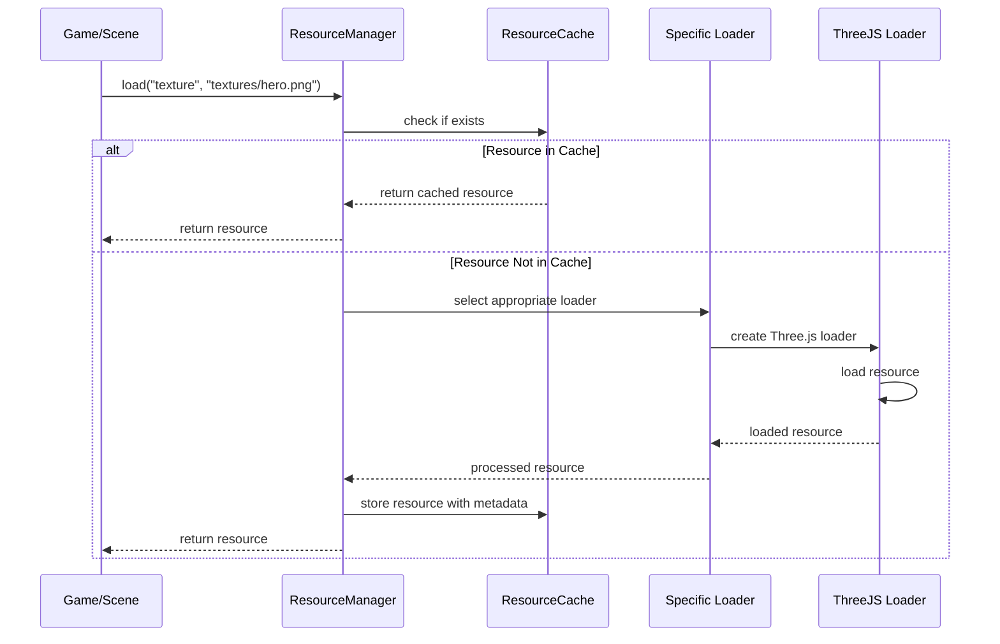

# Resource Management System Plan

## 1. Overview

The Resource Management System will handle loading, caching, and unloading assets for the ThreeJS-based game engine. It will provide a centralized access point for all game resources, optimizing memory usage and improving performance.

## 2. Core Components

```mermaid
classDiagram
    class ResourceManager {
        -resourceLoaders: Map<string, IResourceLoader>
        -cache: ResourceCache
        +register(loader: IResourceLoader): void
        +load<T>(resourceType: string, url: string, options?: any): Promise<T>
        +unload(resourceId: string): void
        +preloadResources(resources: ResourceRequest[]): Promise<void>
    }

    class ResourceCache {
        -resources: Map<string, CachedResource>
        +get<T>(id: string): T
        +set(id: string, resource: any, metadata: ResourceMetadata): void
        +has(id: string): boolean
        +remove(id: string): boolean
        +clear(): void
    }

    class CachedResource {
        +resource: any
        +metadata: ResourceMetadata
        +refCount: number
        +lastAccessed: number
    }

    class ResourceMetadata {
        +type: string
        +size: number
        +persistent: boolean
    }

    interface IResourceLoader {
        +resourceType: string
        +load(url: string, options?: any): Promise<any>
        +unload(resource: any): void
    }

    class TextureLoader {
        +resourceType: string
        +load(url: string, options?: any): Promise<THREE.Texture>
        +unload(texture: THREE.Texture): void
    }

    class ModelLoader {
        +resourceType: string
        +load(url: string, options?: any): Promise<THREE.Group>
        +unload(model: THREE.Group): void
    }

    class AudioLoader {
        +resourceType: string
        +load(url: string, options?: any): Promise<AudioBuffer>
        +unload(audio: AudioBuffer): void
    }

    ResourceManager --> ResourceCache: uses
    ResourceManager --> IResourceLoader: manages
    ResourceCache --> CachedResource: contains
    CachedResource --> ResourceMetadata: has
    IResourceLoader <|.. TextureLoader: implements
    IResourceLoader <|.. ModelLoader: implements
    IResourceLoader <|.. AudioLoader: implements
```

## 3. Resource Types Support

### Recommended Formats & Sources

#### Textures

- **WebP**: Primary format (~30% better compression than PNG/JPG)
  - Conversion tools: [Squoosh](https://squoosh.app/), [cwebp](https://developers.google.com/speed/webp/docs/cwebp)
  - Generate from design tools via plugins for Photoshop, GIMP, etc.
- **KTX2/Basis Universal**: GPU-compressed formats for optimal performance
  - Tools: [KTX-Software](https://github.com/KhronosGroup/KTX-Software), [Basis Universal](https://github.com/BinomialLLC/basis_universal)
  - Excellent for high-performance textures that need fast loading
- **PNG**: Use for alpha channel when WebP isn't supported
- **JPEG**: Only for photographs without transparency needs

#### 3D Models

- **glTF/GLB**: Primary format (industry standard for web)
  - Sources: [Sketchfab](https://sketchfab.com/), [Google Poly](https://poly.pizza/)
  - Export from: Blender, Maya, 3ds Max, Cinema 4D (via glTF exporters)
  - Verification tool: [glTF Validator](https://github.khronos.org/glTF-Validator/)
- **Draco-compressed glTF**: For optimized mesh delivery (70-95% size reduction)
  - Compress using: [gltf-pipeline](https://github.com/CesiumGS/gltf-pipeline), Blender export options
- **OBJ/FBX**: Legacy support only, convert to glTF when possible

#### Audio

- **MP3**: Standard format for most audio content (128-192kbps recommended)
  - Sources: [Freesound](https://freesound.org/), [OpenGameArt](https://opengameart.org/)
  - Tools: Audacity, Adobe Audition, FFMPEG for conversion
- **WebM/Ogg**: Alternative format with better compression but less support
- **WAV**: Uncompressed format, use only for short sound effects

#### Other Assets

- **JSON**: For configuration, level data, etc.
- **GLSL/Shader**: Custom shader code
  - Store as raw text files or JSON
  - Tools: [Shader Playground](https://www.shadertoy.com/), VS Code with GLSL plugins
- **Fonts**:
  - WOFF2: Most efficient web font format
  - Sources: [Google Fonts](https://fonts.google.com/), [Font Squirrel](https://www.fontsquirrel.com/)

### Asset Optimization Guidelines

- Pre-process textures to power-of-two dimensions (256, 512, 1024, 2048)
- Use texture atlases to combine multiple small textures
- Apply mipmaps for distant objects
- Consider using sprite sheets for animated 2D elements
- Set appropriate compression levels based on visual quality requirements
- Store PBR material textures (normal, roughness, metallic) in appropriate channels

## 4. Loading Pipeline



## 5. Resource Lifecycle Management

### Reference Counting

- Track usage of resources
- Increment counter when resource is requested
- Decrement when resource is released
- Auto-unload unused resources based on policies

### Memory Management Policies

- **Time-based**: Unload resources unused for specific time period
- **Memory pressure**: When memory threshold is reached, remove LRU resources
- **Manual control**: Allow forced retention or unloading

## 6. Implementation Details

### Resource Identification

```typescript
// Generate unique resource IDs based on type and path
function generateResourceId(type: string, url: string): string {
  return `${type}://${url}`;
}
```

### Resource Manager Implementation

```typescript
@injectable()
@singleton()
class ResourceManager {
  private loaders: Map<string, IResourceLoader> = new Map();
  private cache: ResourceCache;

  constructor(@inject(ResourceCache) cache: ResourceCache) {
    this.cache = cache;
    // Register default loaders
    this.registerDefaultLoaders();
  }

  async load<T>(type: string, url: string, options?: any): Promise<T> {
    const resourceId = generateResourceId(type, url);

    // Check cache first
    if (this.cache.has(resourceId)) {
      const resource = this.cache.get<T>(resourceId);
      return resource;
    }

    // Get appropriate loader
    const loader = this.loaders.get(type);
    if (!loader) {
      throw new Error(`No loader registered for resource type: ${type}`);
    }

    // Load the resource
    const resource = await loader.load(url, options);

    // Cache it
    this.cache.set(resourceId, resource, {
      type,
      size: this.estimateSize(resource),
      persistent: options?.persistent || false,
    });

    return resource as T;
  }

  // ... additional methods
}
```

## 7. Asset Preloading

Enable batch loading of resources for scenes, levels or game startup:

```typescript
interface PreloadManifest {
  textures?: { url: string; options?: any }[];
  models?: { url: string; options?: any }[];
  audio?: { url: string; options?: any }[];
  // Other resource types
}

async function preloadLevel(levelId: string): Promise<void> {
  const manifest = await resourceManager.load<PreloadManifest>(
    'json',
    `levels/${levelId}/manifest.json`
  );

  // Create loading tasks
  const tasks: Promise<any>[] = [];

  // Add texture loading tasks
  if (manifest.textures) {
    for (const texture of manifest.textures) {
      tasks.push(resourceManager.load('texture', texture.url, texture.options));
    }
  }

  // Add model loading tasks
  if (manifest.models) {
    for (const model of manifest.models) {
      tasks.push(resourceManager.load('model', model.url, model.options));
    }
  }

  // Add audio loading tasks
  if (manifest.audio) {
    for (const audio of manifest.audio) {
      tasks.push(resourceManager.load('audio', audio.url, audio.options));
    }
  }

  // Wait for all resources to load
  await Promise.all(tasks);
}
```
