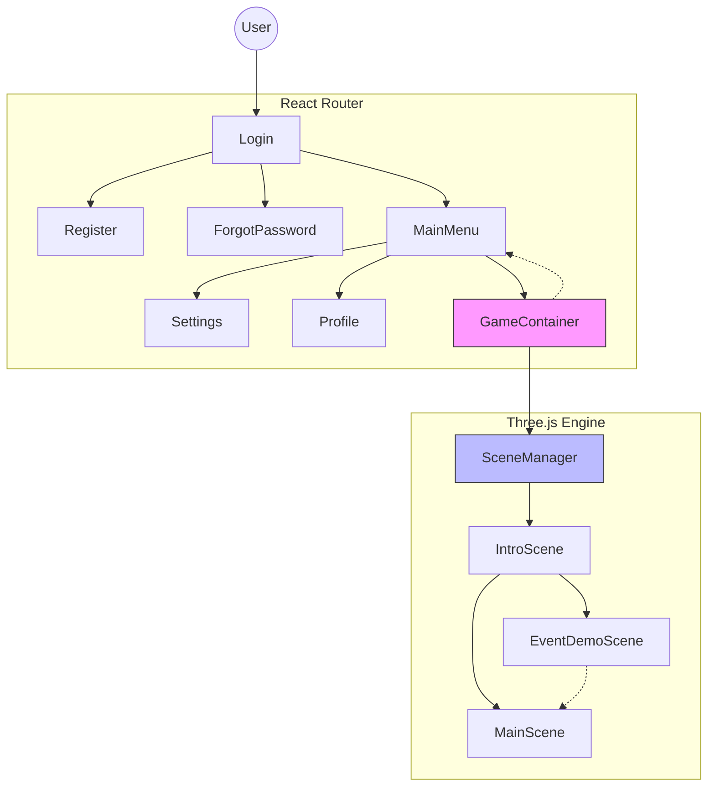
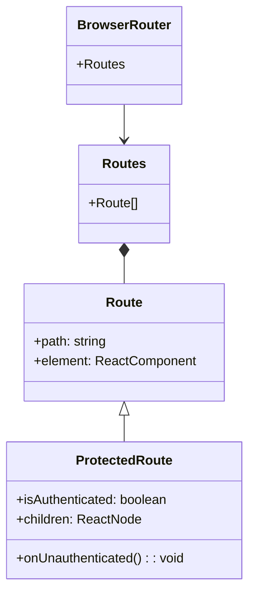
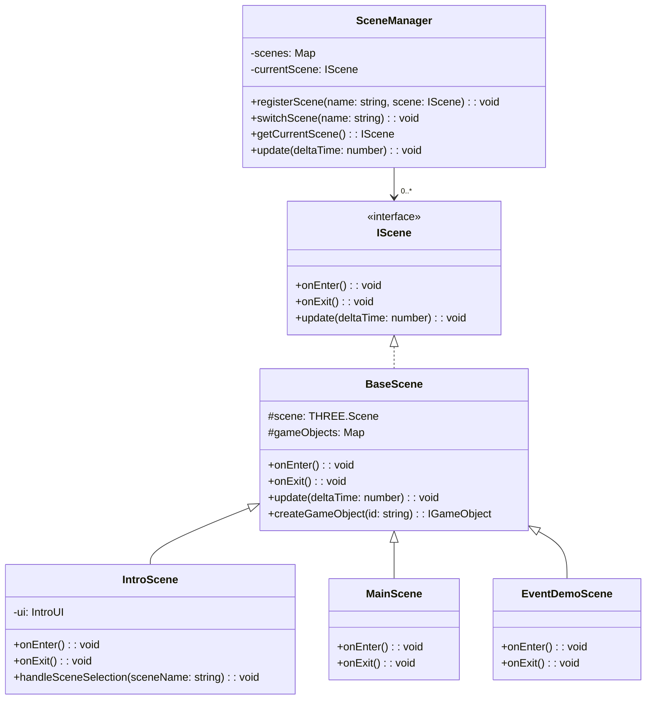
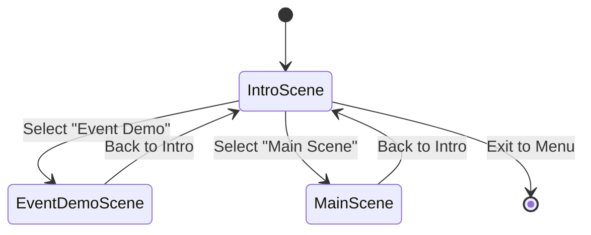
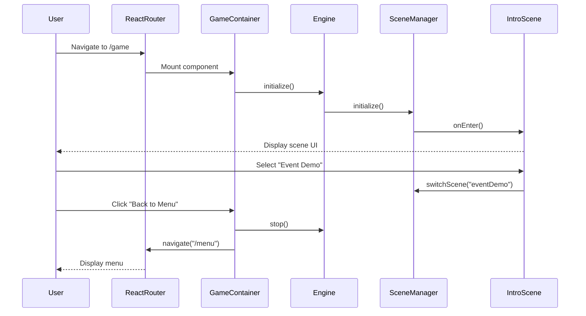
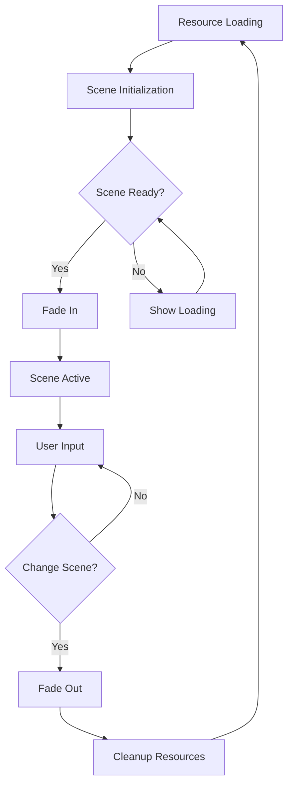
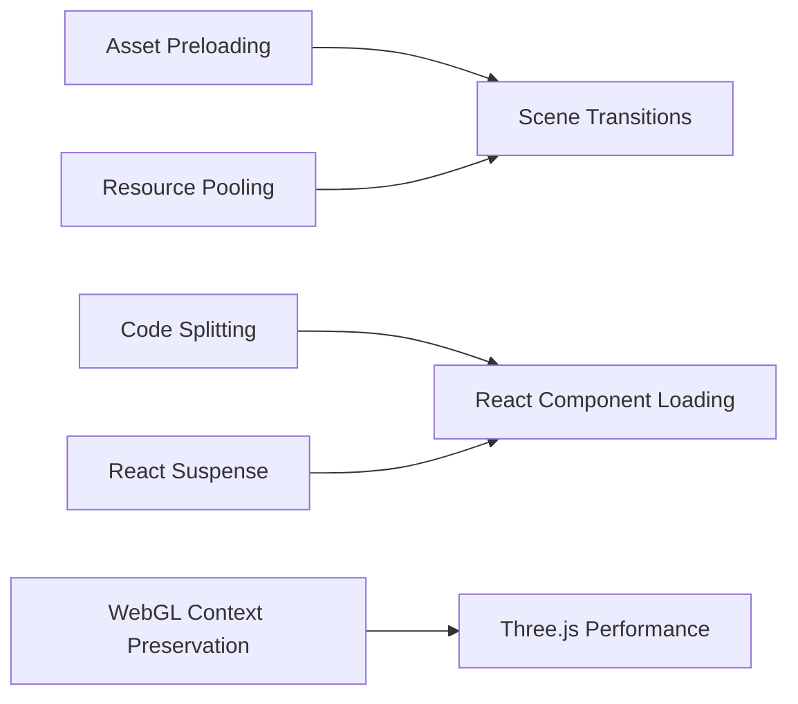

# Routing Architecture: React Router & Three.js Scene Management

## Overview

This project implements a hybrid routing architecture that separates concerns:

- **React Router**: Handles traditional web navigation for authentication, menus, and settings
- **Three.js Scene Manager**: Manages in-game scene transitions and game state

This approach allows each system to excel at what it does best while maintaining a clean separation of concerns.



## React Router Architecture

### Routing Structure

React Router manages all non-game navigation through a traditional URL-based approach.



### URL Structure

| Path               | Component        | Description                    |
| ------------------ | ---------------- | ------------------------------ |
| `/`                | `Login`          | Authentication entry point     |
| `/register`        | `Register`       | New user registration          |
| `/forgot-password` | `ForgotPassword` | Password recovery flow         |
| `/menu`            | `MainMenu`       | Game selection and main menu   |
| `/settings`        | `Settings`       | User preferences               |
| `/profile`         | `UserProfile`    | User profile management        |
| `/game`            | `GameContainer`  | Entry point to Three.js engine |

### Implementation Example

```typescript
// App.tsx
const App: React.FC = () => {
  return (
    <BrowserRouter>
      <Routes>
        <Route path='/' element={<Login />} />
        <Route path='/register' element={<Register />} />
        <Route path='/forgot-password' element={<ForgotPassword />} />
        <Route
          path='/menu'
          element={
            <ProtectedRoute>
              <MainMenu />
            </ProtectedRoute>
          }
        />
        <Route
          path='/settings'
          element={
            <ProtectedRoute>
              <Settings />
            </ProtectedRoute>
          }
        />
        <Route
          path='/profile'
          element={
            <ProtectedRoute>
              <UserProfile />
            </ProtectedRoute>
          }
        />
        <Route
          path='/game'
          element={
            <ProtectedRoute>
              <GameContainer />
            </ProtectedRoute>
          }
        />
        <Route path='*' element={<Navigate to='/' replace />} />
      </Routes>
    </BrowserRouter>
  );
};
```

## Three.js Scene Management

The Three.js engine uses a scene-based architecture for managing game states and transitions.



### Scene Transition Flow



### Scene Transition Implementation

```typescript
// SceneManager.ts
switchScene(name: string): void {
  // Exit current scene if exists
  if (this.currentScene) {
    this.currentScene.onExit();
  }

  // Get and enter new scene
  const newScene = this.scenes.get(name);
  if (!newScene) {
    throw new Error(`Scene ${name} not found`);
  }

  this.currentScene = newScene;
  this.currentScene.onEnter();
}
```

## Integration Between Systems

The key to a seamless user experience is proper integration between React Router and Three.js scene management.



### Key Integration Points

1. **Game Initialization**: When navigating to `/game`, React initializes the Three.js engine
2. **UI Integration**: Game UI components overlay on top of Three.js canvas
3. **Exit Points**: "Back to Menu" button stops the engine and returns to React Router

```typescript
// GameContainer.tsx
const GameContainer: React.FC = () => {
  const navigate = useNavigate();
  const [app, setApp] = useState<Application | null>(null);

  useEffect(() => {
    // Initialize game engine
    const gameApp = container.resolve(Application);
    setApp(gameApp);
    gameApp.start();

    return () => {
      // Cleanup when component unmounts
      if (app) {
        app.stop();
      }
    };
  }, []);

  const handleBackToMenu = () => {
    if (app) {
      app.stop();
    }
    navigate('/menu');
  };

  return (
    <div style={{ width: '100%', height: '100%' }}>
      {/* UI overlays */}
      <button onClick={handleBackToMenu}>Back to Menu</button>
    </div>
  );
};
```

## Best Practices

### React Router Best Practices

1. **Authentication Guards**: Protect routes that require authentication
2. **Code Splitting**: Use React.lazy() for route-based code splitting
3. **Consistent Navigation**: Provide clear navigation patterns and breadcrumbs
4. **Loading States**: Show loading indicators during transitions

### Three.js Scene Best Practices

1. **Resource Management**: Load and unload resources during scene transitions
2. **Transition Effects**: Use smooth transitions between scenes
3. **State Persistence**: Maintain relevant state between scene transitions
4. **Error Handling**: Implement fallback scenes for error conditions



## Implementation Guidelines

### React Integration Points

- Use dependency injection for sharing services between React and Three.js
- Create abstraction layers for communication between systems
- Implement custom hooks for game-related functionality

### Game Engine Initialization

Proper initialization is critical for seamless integration:

```typescript
// Application.ts
@injectable()
@singleton()
export class Application {
  constructor(
    private engine: Engine,
    private sceneManager: SceneManager,
    private mainScene: MainScene,
    private introScene: IntroScene,
    private eventDemoScene: EventDemoScene
  ) {
    this.initialize();
  }

  private initialize(): void {
    // Register all scenes
    this.sceneManager.registerScene('main', this.mainScene);
    this.sceneManager.registerScene('intro', this.introScene);
    this.sceneManager.registerScene('eventDemo', this.eventDemoScene);

    // Start with the intro scene
    this.sceneManager.switchScene('intro');
  }

  public start(): void {
    this.engine.start();
  }

  public stop(): void {
    this.engine.stop();
  }
}
```

## Error Handling and Edge Cases

1. **Failed Scene Loading**: Implement fallback scenes and error reporting
2. **Deep Linking**: Handle direct navigation to `/game` with proper initialization
3. **Resource Cleanup**: Ensure proper cleanup when switching between React and Three.js
4. **Browser Refresh**: Manage state persistence across page reloads

## Performance Considerations



1. **Asset Management**: Preload assets for common scenes
2. **React Performance**: Minimize component re-renders during game operation
3. **Three.js Optimization**: Implement proper resource management and disposal
4. **Memory Management**: Watch for and prevent memory leaks, especially during transitions

## Conclusion

This hybrid routing architecture provides the best of both worlds: React Router for traditional web navigation and Three.js scene management for immersive game experiences. By clearly defining the boundaries and integration points between these systems, we create a maintainable and performant application structure.
