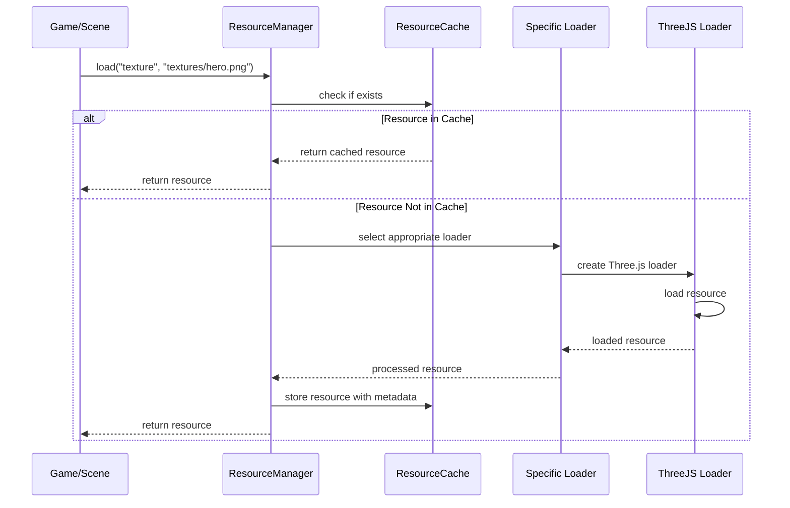

# Resource Management System Plan

## 1. Overview

The Resource Management System will handle loading, caching, and unloading assets for the ThreeJS-based game engine. It will provide a centralized access point for all game resources, optimizing memory usage and improving performance.

## 2. Core Components

```mermaid
classDiagram
    class ResourceManager {
        -resourceLoaders: Map<string, IResourceLoader>
        -cache: ResourceCache
        +register(loader: IResourceLoader): void
        +load<T>(resourceType: string, url: string, options?: any): Promise<T>
        +unload(resourceId: string): void
        +preloadResources(resources: ResourceRequest[]): Promise<void>
    }

    class ResourceCache {
        -resources: Map<string, CachedResource>
        +get<T>(id: string): T
        +set(id: string, resource: any, metadata: ResourceMetadata): void
        +has(id: string): boolean
        +remove(id: string): boolean
        +clear(): void
    }

    class CachedResource {
        +resource: any
        +metadata: ResourceMetadata
        +refCount: number
        +lastAccessed: number
    }

    class ResourceMetadata {
        +type: string
        +size: number
        +persistent: boolean
    }

    interface IResourceLoader {
        +resourceType: string
        +load(url: string, options?: any): Promise<any>
        +unload(resource: any): void
    }

    class TextureLoader {
        +resourceType: string
        +load(url: string, options?: any): Promise<THREE.Texture>
        +unload(texture: THREE.Texture): void
    }

    class ModelLoader {
        +resourceType: string
        +load(url: string, options?: any): Promise<THREE.Group>
        +unload(model: THREE.Group): void
    }

    class AudioLoader {
        +resourceType: string
        +load(url: string, options?: any): Promise<AudioBuffer>
        +unload(audio: AudioBuffer): void
    }

    ResourceManager --> ResourceCache: uses
    ResourceManager --> IResourceLoader: manages
    ResourceCache --> CachedResource: contains
    CachedResource --> ResourceMetadata: has
    IResourceLoader <|.. TextureLoader: implements
    IResourceLoader <|.. ModelLoader: implements
    IResourceLoader <|.. AudioLoader: implements
```

## 3. Resource Types Support

- **Textures**: PNG, JPG, WebP images for materials and UI
- **3D Models**: GLTF/GLB, OBJ, FBX formats
- **Audio**: MP3, WAV files for sound effects and music
- **JSON**: For configuration, level data, etc.
- **Shaders**: GLSL shader code
- **Fonts**: For text rendering

## 4. Loading Pipeline



## 5. Resource Lifecycle Management

### Reference Counting

- Track usage of resources
- Increment counter when resource is requested
- Decrement when resource is released
- Auto-unload unused resources based on policies

### Memory Management Policies

- **Time-based**: Unload resources unused for specific time period
- **Memory pressure**: When memory threshold is reached, remove LRU resources
- **Manual control**: Allow forced retention or unloading

## 6. Implementation Details

### Resource Identification

```typescript
// Generate unique resource IDs based on type and path
function generateResourceId(type: string, url: string): string {
  return `${type}://${url}`;
}
```

### Resource Manager Implementation

```typescript
@injectable()
@singleton()
class ResourceManager {
  private loaders: Map<string, IResourceLoader> = new Map();
  private cache: ResourceCache;

  constructor(@inject(ResourceCache) cache: ResourceCache) {
    this.cache = cache;
    // Register default loaders
    this.registerDefaultLoaders();
  }

  async load<T>(type: string, url: string, options?: any): Promise<T> {
    const resourceId = generateResourceId(type, url);

    // Check cache first
    if (this.cache.has(resourceId)) {
      const resource = this.cache.get<T>(resourceId);
      return resource;
    }

    // Get appropriate loader
    const loader = this.loaders.get(type);
    if (!loader) {
      throw new Error(`No loader registered for resource type: ${type}`);
    }

    // Load the resource
    const resource = await loader.load(url, options);

    // Cache it
    this.cache.set(resourceId, resource, {
      type,
      size: this.estimateSize(resource),
      persistent: options?.persistent || false,
    });

    return resource as T;
  }

  // ... additional methods
}
```

## 7. Asset Preloading

Enable batch loading of resources for scenes, levels or game startup:

```typescript
interface PreloadManifest {
  textures?: { url: string; options?: any }[];
  models?: { url: string; options?: any }[];
  audio?: { url: string; options?: any }[];
  // Other resource types
}

async function preloadLevel(levelId: string): Promise<void> {
  const manifest = await resourceManager.load<PreloadManifest>(
    'json',
    `levels/${levelId}/manifest.json`
  );

  // Create loading tasks
  const tasks: Promise<any>[] = [];

  // Add texture loading tasks
  if (manifest.textures) {
    for (const texture of manifest.textures) {
      tasks.push(resourceManager.load('texture', texture.url, texture.options));
    }
  }

  // Add model loading tasks
  if (manifest.models) {
    for (const model of manifest.models) {
      tasks.push(resourceManager.load('model', model.url, model.options));
    }
  }

  // Add audio loading tasks
  if (manifest.audio) {
    for (const audio of manifest.audio) {
      tasks.push(resourceManager.load('audio', audio.url, audio.options));
    }
  }

  // Wait for all resources to load
  await Promise.all(tasks);
}
```

## 8. Resource Unloading and Cleanup

```typescript
// Scene cleanup on exit
function cleanupScene(): void {
  // Unload non-persistent resources associated with the scene
  resourceManager.unloadByTag('level-1');
}

// Application shutdown
function shutdown(): void {
  // Release all resources
  resourceManager.unloadAll();
}
```

## 9. Resource Organization

### Directory Structure

```
assets/
├── textures/
│   ├── environment/
│   ├── characters/
│   └── ui/
├── models/
│   ├── environment/
│   ├── characters/
│   └── props/
├── audio/
│   ├── music/
│   └── sfx/
└── shaders/
    ├── common/
    └── postprocess/
```

### Manifest Files

```json
{
  "name": "Level 1",
  "resources": {
    "textures": [
      {
        "url": "textures/environment/grass.jpg",
        "options": { "wrapS": "repeat", "wrapT": "repeat" }
      },
      {
        "url": "textures/characters/player.png",
        "options": { "persistent": true }
      }
    ],
    "models": [
      { "url": "models/environment/level1.glb", "options": { "scale": 1.0 } },
      { "url": "models/characters/enemy1.glb", "options": {} }
    ],
    "audio": [
      { "url": "audio/music/level1_theme.mp3", "options": { "volume": 0.8 } },
      { "url": "audio/sfx/explosion.wav", "options": {} }
    ]
  }
}
```

## 10. Progress Tracking and Error Handling

```typescript
interface LoadingProgress {
  resourceId: string;
  progress: number; // 0-1
  status: 'loading' | 'complete' | 'error';
  error?: Error;
}

// Loading with progress reporting
async function loadLevelWithProgress(
  levelId: string,
  onProgress: (overall: number, details: LoadingProgress[]) => void
): Promise<void> {
  // Implementation with progress callbacks
}
```

## 11. Future Expansion

- **Resource Streaming**: Load and unload resources dynamically during gameplay
- **LOD System**: Multiple detail levels for models and textures
- **Asset Processing Pipeline**: Build-time optimization of assets
- **Compressed Texture Support**: KTX2, basis universal formats
- **Asset Bundles**: Group resources together in downloadable packages
